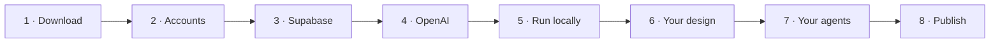

<div align="center">

[🇧🇷 Português](README.md) · **🇺🇸 English**

# Your own AI agent, trained on your method.
### With login, automatic sales and an admin dashboard. Live in an afternoon.

Add your materials, create your agents and grant access to whoever bought.<br>
**The whole backend is ready. You only swap 3 things.**

<picture>
  <source media="(prefers-color-scheme: dark)" srcset="docs/img/hero-escuro.png">
  
</picture>

[**Start with AI (no coding)**](#-start-in-3-steps-with-ai) · [**Full step-by-step guide**](docs/README.md) · [**See the screens**](#-take-a-look-inside)

[](https://vercel.com/new/clone?repository-url=https%3A%2F%2Fgithub.com%2Fnomicsadmin%2Fhub-agentes-ia&project-name=hub-agentes-ia&repository-name=hub-agentes-ia&env=NEXT_PUBLIC_SUPABASE_URL%2CNEXT_PUBLIC_SUPABASE_ANON_KEY%2CSUPABASE_SERVICE_ROLE_KEY%2COPENAI_API_KEY%2COPENAI_MODEL%2CNEXT_PUBLIC_SITE_URL%2CCRON_SECRET&envDescription=Supabase+and+OpenAI+keys.+Create+the+database+first+%28docs%2F03-supabase.md%29.&envLink=https%3A%2F%2Fgithub.com%2Fnomicsadmin%2Fhub-agentes-ia%2Fblob%2Fmain%2Fdocs%2F09-deploy-vercel.md)

<sub>Open-source AI agent hub template · Next.js + Supabase + OpenAI · RAG chatbot with auth, payments and admin dashboard</sub>

    

</div>

> **About the language:** the app interface and the step-by-step guides in `docs/` are in Brazilian Portuguese. The AI setup script works in any language: ask it to guide you in English. Translations of the docs are very welcome ([how to contribute](CONTRIBUTING.md)).

---

## ✨ What you get out of the box

| | | |
|---|---|---|
| 💬 **Streaming chat**<br>The text appears while the agent writes. | 📚 **Agents trained on your PDFs**<br>They answer only from your material. No making things up. | 🎙️ **Voice and attachments**<br>Send audio, a screenshot or a PDF, and the agent understands it. |
| 📄 **PDFs generated by the AI**<br>Checklists and scripts ready to download. | 💳 **Automatic sales**<br>Bought it, gets an invite. Refunded, loses access. | 📊 **Engagement dashboard**<br>Who is active and who went quiet for 7, 15 and 30 days. |
| 🧭 **Topics & difficulties**<br>Where your audience gets stuck and what is missing from your material. | 🛠️ **Correct the agent without code**<br>Edit the prompt and add rules right from the dashboard. | 📱 **Built for mobile**<br>Installs like an app. Light and dark themes. |

## 🔁 You only swap 3 things

| 🎨 Your design | 📚 Your materials | 🤖 Your agents |
|---|---|---|
| Colors, fonts and logo in one file. | PDFs, workbooks and transcripts in a folder. | Name, tone and rules in plain text. |
| [How to swap →](docs/06-design-system.md) | [How to prepare →](docs/07-inteligencia-e-agentes.md) | [How to create →](docs/07-inteligencia-e-agentes.md) |

---

## 🚀 Start in 3 steps with AI

**No coding required.** The AI runs the same process we used to build this hub: it asks questions, reads your materials, shows what it understood and only changes something after you approve.

**1. Download the project and open it in Claude Code**
Click **Code > Download ZIP** (or **Use this template**), unzip it and open the folder in the [Claude Code](https://claude.com/claude-code) app. Cursor and Codex work too.

**2. Put your materials in the `meus-materiais/` folder**
PDFs, workbooks, class transcripts, your logo. They stay only on your computer.

**3. Paste this sentence into the AI**
```text
Read COMECE-AQUI.md and build my agent hub. Please guide me in English.
```

That's it. The AI will interview you, create the agents, apply your branding, walk you click by click through Supabase, OpenAI and Vercel, test everything and publish.

> 💡 What does it cost to run? You can start on the free plans of Supabase and Vercel and pay only for OpenAI usage. [See the table](docs/02-pre-requisitos.md#quanto-custa-manter-estimativa) (in Portuguese).

---

## 👀 Take a look inside

| | | |
|---|---|---|
|  |  |  |
| Chat on the phone | Voice and attachments | PDF generated by the agent |
|  |  |  |
| Admin dashboard | Topics & difficulties | Agent and corrections |

---

## 🛠️ Prefer to do it by hand?



| Step | What to do | Time |
|---|---|---|
| **1 · Download** | `git clone` or **Use this template**, then `npm install` | 5 min |
| **2 · Accounts** | [Node 22.18+, Supabase, OpenAI, Vercel](docs/02-pre-requisitos.md) | 20 min |
| **3 · Supabase** | [Create the project, `npm run setup`, `npx supabase db push`](docs/03-supabase.md) | 15 min |
| **4 · OpenAI** | [Key and model](docs/04-openai.md) | 10 min |
| **5 · Run locally** | [`npm run agentes:sync`, `npm run admin:criar`, `npm run dev`](docs/05-rodar-local.md) | 10 min |
| **6 · Your design** | [Tokens, logo, name](docs/06-design-system.md) | 20 to 60 min |
| **7 · Your agents** | [The `agentes/` folder and testing each agent](docs/07-inteligencia-e-agentes.md) | 30 min/agent |
| **8 · Publish** | [Vercel, domain and payment webhook](docs/09-deploy-vercel.md) | 20 min |

With the app running, **http://localhost:3000/setup** shows live what is ready and what is missing, with the command that fixes each item.

```bash
npm install
```
```bash
npm run setup
```

---

## 🆘 Stuck? AI has your back

Every step has a ready-to-paste request for your AI. Run `npm run diagnostico`: it generates a report **without any keys**. [See how to ask for help →](docs/ajuda-com-ia.md)

---

## 🔒 Secure by default
Each person only sees their own data (row-level security in the database). Keys live only on the server, and the build fails if any of them leaks to the browser. Files are stored in private buckets and sign-up is closed: only people who bought or were invited get in. [Details →](docs/11-seguranca.md)

## 📖 How this was built
Planning with AI, a design system, a security base and four parallel tracks, all in one day. [Read the story and reuse the recipe →](docs/01-como-construimos.md)

**Stack:** Next.js 16 (App Router) · Supabase (Postgres, Auth, Storage, RLS, pgvector) · OpenAI Responses API · Vercel · Tailwind v4 · shadcn/ui.

<div align="center">

<br>

Created by

<a href="https://gruponomics.com.br" title="Nomics Tech">
  <picture>
    <source media="(prefers-color-scheme: dark)" srcset="docs/img/nomics-tech-escuro.png">
    
  </picture>
</a>

<br><br>

**MIT License** · Next.js · Supabase · OpenAI · Vercel · Made with ❤️ and AI

</div>
