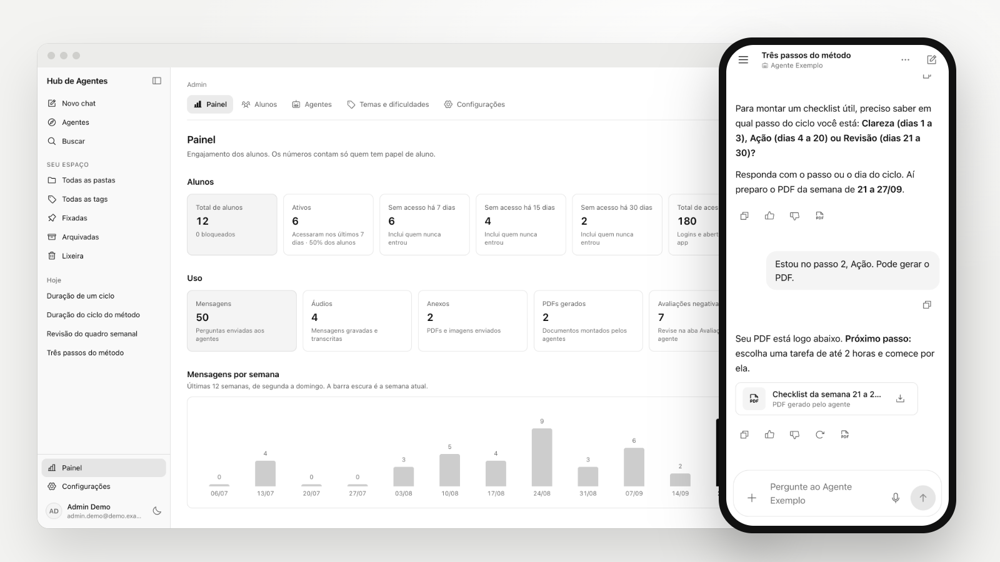
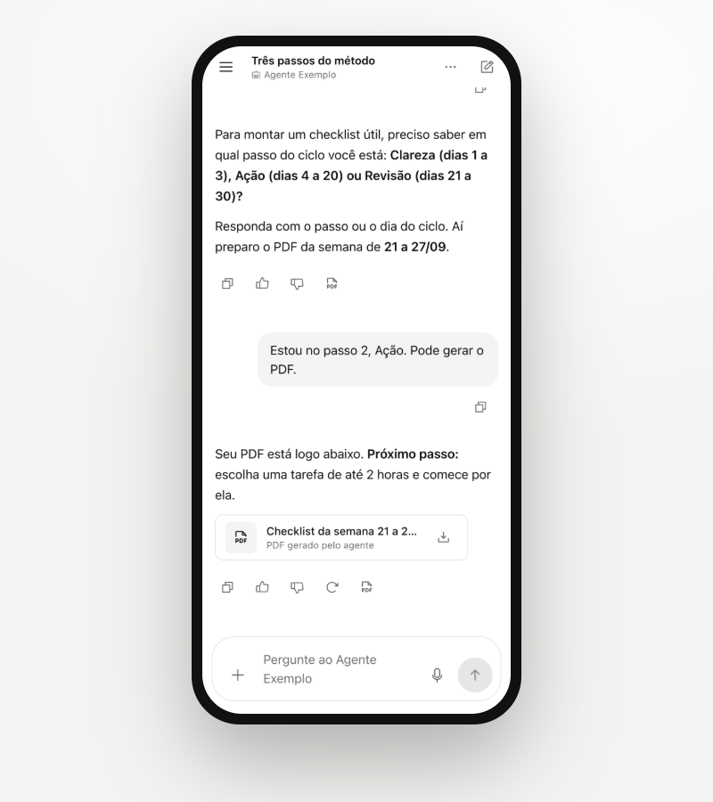
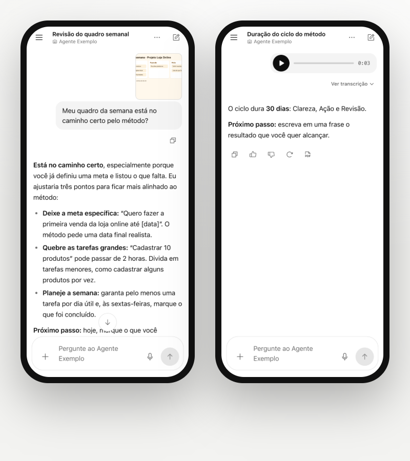
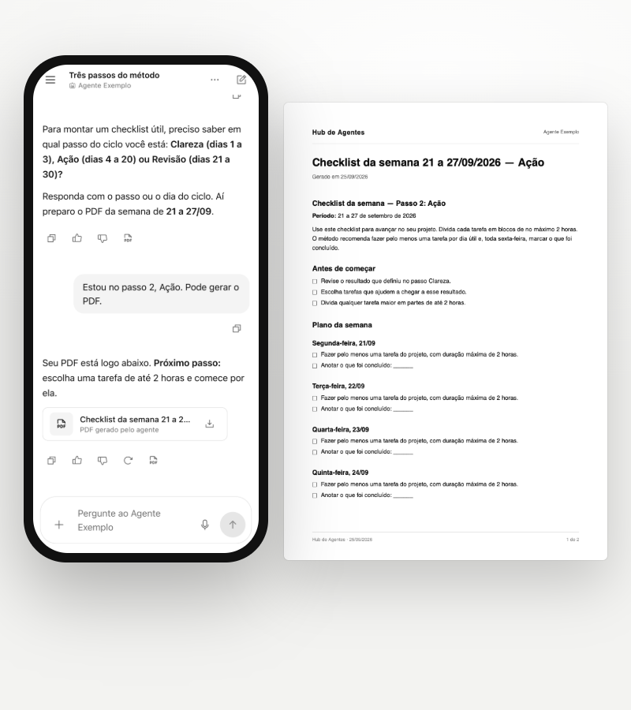
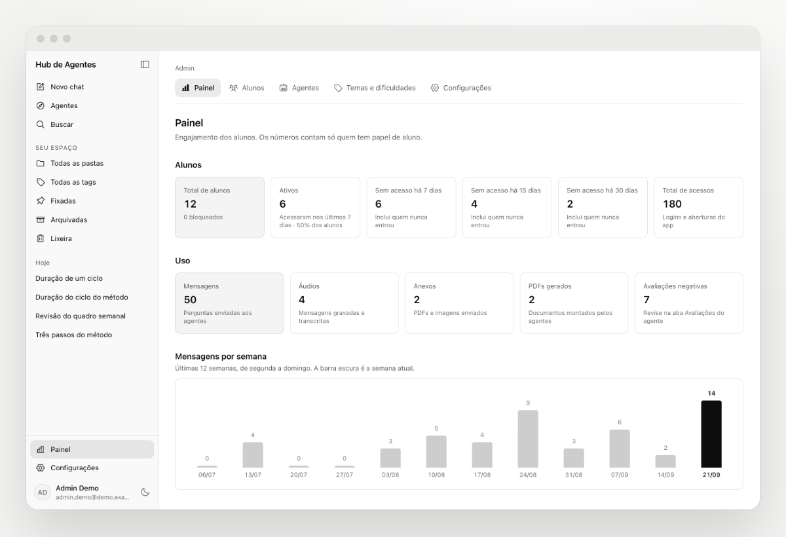
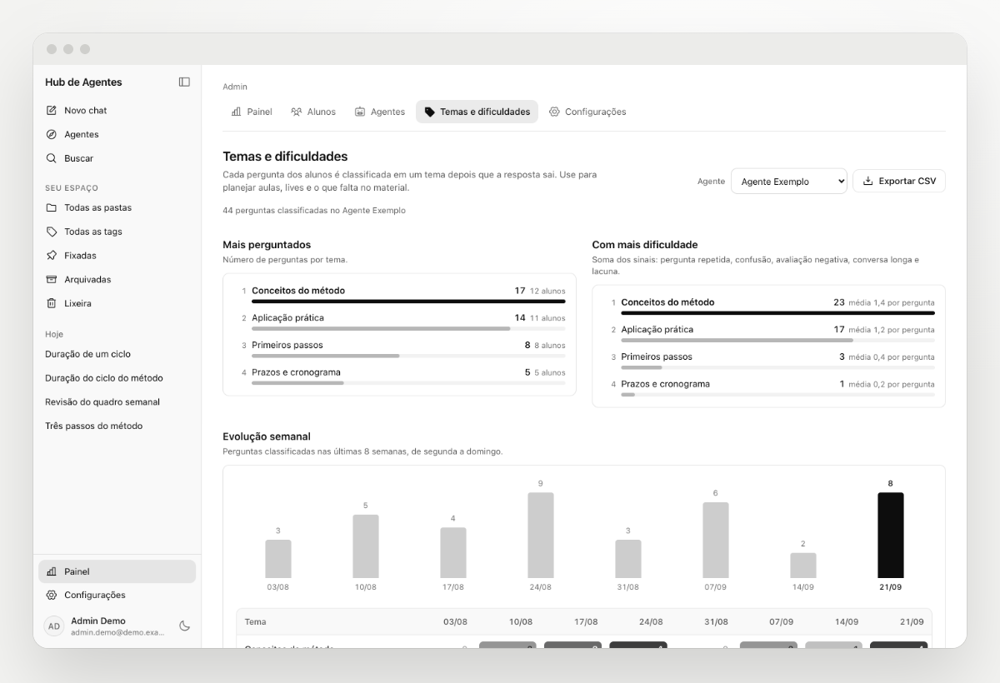
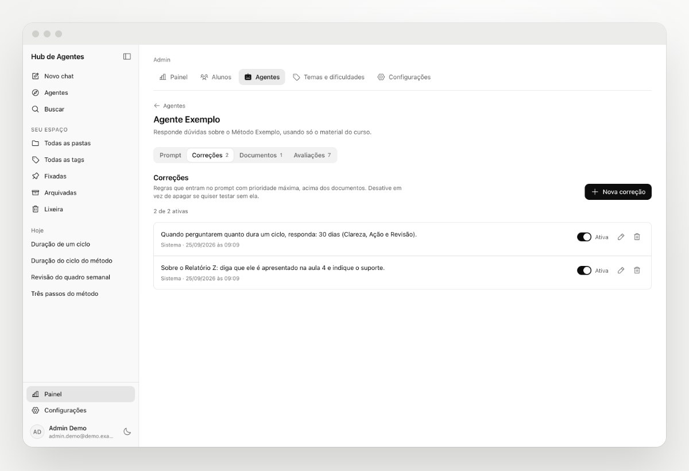
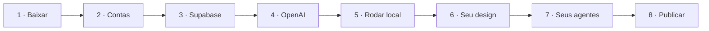

<div align="center">

# Seu próprio Agente de IA treinado no seu método.
### Com login, venda automática e painel de controle. No ar em uma tarde.

Coloque seus materiais, crie seus agentes e libere o acesso para quem comprou.<br>
**O backend inteiro já está pronto. Você só troca 3 coisas.**

<picture>
  <source media="(prefers-color-scheme: dark)" srcset="docs/img/hero-escuro.png">
  
</picture>

[**Começar com IA (sem programar)**](#-comece-em-3-passos-com-a-ia) · [**Passo a passo completo**](docs/README.md) · [**Ver as telas**](#-veja-por-dentro)

    

</div>

---

## ✨ O que você recebe pronto

| | | |
|---|---|---|
| 💬 **Chat com resposta ao vivo**<br>O texto aparece enquanto o agente escreve. | 📚 **Agentes treinados nos seus PDFs**<br>Respondem só com o seu material. Não inventam. | 🎙️ **Áudio e anexos**<br>Manda áudio, print ou PDF, e o agente entende. |
| 📄 **PDF gerado pela IA**<br>Checklists e roteiros prontos para baixar. | 💳 **Venda automática**<br>Comprou, recebe o convite. Reembolsou, perde o acesso. | 📊 **Painel de engajamento**<br>Quem está ativo e quem sumiu há 7, 15 e 30 dias. |
| 🧭 **Temas e dificuldades**<br>Onde o seu público mais trava e o que falta no material. | 🛠️ **Corrija o agente sem código**<br>Edite o prompt e crie regras direto no painel. | 📱 **Feito para o celular**<br>Instala como app. Tema claro e escuro. |

## 🔁 Você só troca 3 coisas

| 🎨 Seu design | 📚 Seus materiais | 🤖 Seus agentes |
|---|---|---|
| Cores, fontes e logo em um arquivo. | PDFs, apostilas e transcrições na pasta. | Nome, tom e regras em texto simples. |
| [Como trocar →](docs/06-design-system.md) | [Como preparar →](docs/07-inteligencia-e-agentes.md) | [Como criar →](docs/07-inteligencia-e-agentes.md) |

---

## 🚀 Comece em 3 passos com a IA

**Não precisa saber programar.** A IA conduz o mesmo processo que usamos para construir este hub: pergunta, lê seus materiais, mostra o que entendeu e só muda algo quando você aprovar.

**1. Baixe o projeto e abra no Claude Code**
Clique em **Code > Download ZIP** (ou **Use this template**), descompacte e abra a pasta no app [Claude Code](https://claude.com/claude-code). Cursor e Codex também funcionam.

**2. Coloque seus materiais na pasta `meus-materiais/`**
PDFs, apostilas, transcrições de aulas, seu logo. Eles ficam só no seu computador.

**3. Cole esta frase na IA**
```text
Leia o COMECE-AQUI.md e monte o meu hub de agentes.
```

Pronto. A IA vai te entrevistar, criar os agentes, aplicar o seu visual, te guiar clique a clique no Supabase, na OpenAI e na Vercel, testar tudo e publicar.

> 💡 Quanto custa manter? Dá para começar de graça no Supabase e na Vercel e pagar só o uso da OpenAI. [Veja a tabela](docs/02-pre-requisitos.md#quanto-custa-manter-estimativa).

---

## 👀 Veja por dentro

| | | |
|---|---|---|
|  |  |  |
| Chat no celular | Áudio e anexos | PDF gerado pelo agente |
|  |  |  |
| Painel admin | Temas e dificuldades | Agente e correções |

---

## 🛠️ Prefere fazer na mão?



| Passo | O que fazer | Tempo |
|---|---|---|
| **1 · Baixar** | `git clone` ou **Use this template**, depois `npm install` | 5 min |
| **2 · Contas** | [Node 22.18+, Supabase, OpenAI, Vercel](docs/02-pre-requisitos.md) | 20 min |
| **3 · Supabase** | [Criar o projeto, `npm run setup`, `npx supabase db push`](docs/03-supabase.md) | 15 min |
| **4 · OpenAI** | [Chave e modelo](docs/04-openai.md) | 10 min |
| **5 · Rodar local** | [`npm run agentes:sync`, `npm run admin:criar`, `npm run dev`](docs/05-rodar-local.md) | 10 min |
| **6 · Seu design** | [Tokens, logo, nome](docs/06-design-system.md) | 20 a 60 min |
| **7 · Seus agentes** | [Pasta `agentes/` e teste de cada agente](docs/07-inteligencia-e-agentes.md) | 30 min/agente |
| **8 · Publicar** | [Vercel, domínio e webhook de pagamento](docs/09-deploy-vercel.md) | 20 min |

Com o app rodando, **http://localhost:3000/setup** mostra ao vivo o que já está pronto e o que falta, com o comando para resolver cada item.

```bash
npm install
```
```bash
npm run setup
```

---

## 🆘 Travou? A IA te ajuda

Todo passo tem um pedido pronto para colar na sua IA. Rode `npm run diagnostico`: ele gera um relatório **sem nenhuma chave**. [Veja como pedir ajuda →](docs/ajuda-com-ia.md)

---

## 🔒 Seguro por padrão
Cada pessoa só vê os próprios dados (RLS no banco). As chaves ficam só no servidor e o build falha se alguma vazar para o navegador. Arquivos ficam em buckets privados e o cadastro é fechado: só entra quem comprou ou foi convidado. [Detalhes →](docs/11-seguranca.md)

## 📖 Como isto foi construído
Planejamento com IA, design system, base de segurança e quatro frentes em paralelo, tudo em um dia. [Leia a história e use a mesma receita →](docs/01-como-construimos.md)

<div align="center">

<br>

Criado pela

<a href="https://gruponomics.com.br" title="Nomics Tech"> <b>Nomics Tech</b></a>

<br><br>

**Licença MIT** · Next.js · Supabase · OpenAI · Vercel · Feito com ❤️ e IA

</div>
