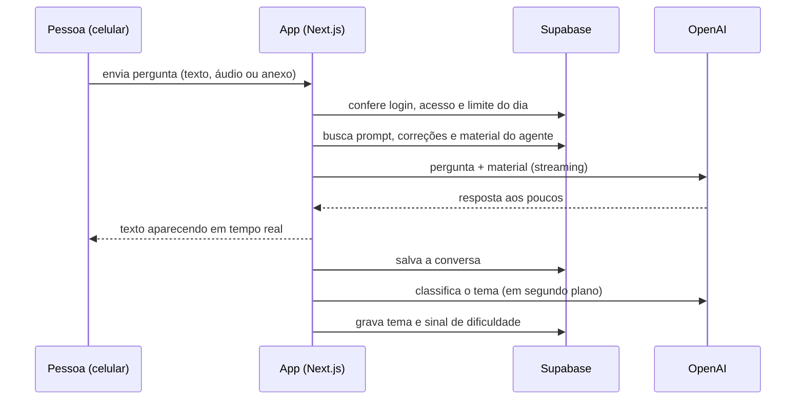

# 00 · Visão geral

> Como o hub funciona por dentro, em uma página. ⏱ 5 min de leitura.

## O que é
Um app web (funciona como aplicativo no celular) onde as pessoas que compraram o seu produto conversam com **agentes de IA treinados no seu material**. Você controla tudo por um **painel admin**: quem tem acesso, o que os agentes sabem, correções e métricas.

## As peças

| Peça | Para que serve | Onde fica |
|---|---|---|
| **Next.js** | O app (telas) e o servidor (APIs) | `src/` |
| **Supabase** | Banco de dados, login, arquivos | conta no supabase.com + `supabase/migrations/` |
| **OpenAI** | A inteligência dos agentes, transcrição de áudio | conta no platform.openai.com |
| **Vercel** | Hospedagem na internet | conta no vercel.com |
| **Pagamento** (opcional) | Libera o acesso quando alguém compra | webhook `src/app/api/webhooks/[provider]` |

## O caminho de uma mensagem



## Como o agente "sabe" o seu material
- **Até ~80 mil tokens** (uns 200 a 250 páginas de texto) por agente: o material vai **inteiro** nas instruções, com cache da OpenAI para ficar barato. É o jeito mais preciso.
- **Acima disso:** o app divide o material em trechos e, a cada pergunta, busca os mais relevantes (RAG). Automático, você não precisa fazer nada.
- A cada mensagem o agente também recebe a **data de hoje** (útil para prazos e cronogramas).
- **Correções do admin** entram com prioridade máxima, acima do material.

## Mapa de pastas
```text
agentes/            seus agentes (um por pasta) + temas
meus-materiais/     onde você solta PDFs e logo (não vai para o GitHub)
src/config/         nome, público, fuso: app.config.ts
src/app/globals.css seu design system (tokens de cor, fonte, raio)
src/app/            telas e APIs
src/lib/ai/         prompt, chat, PDF, classificação de temas
src/lib/payments/   adaptadores de pagamento (Hubla pronto)
supabase/           banco (migrations) e e-mails de convite
scripts/            setup, sync de agentes, admin, diagnóstico
docs/               este passo a passo
```

---

[← Início](../README.md) · [Índice](README.md) · [Como construímos →](01-como-construimos.md)
