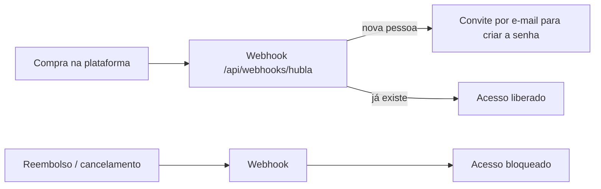

# 08 · Pagamento (venda automática)

> Liberar o acesso sozinho quando alguém compra, e bloquear no reembolso. ⏱ 15 min · 🧰 conta na Hubla (ou outra plataforma).

## Como funciona

- Cada aviso é processado **uma vez só** (reenvios são ignorados).
- Admin **nunca** é bloqueado.
- Sem pagamento configurado, tudo funciona por **convite manual**: **Admin > [seu público, ex.: Alunos] > Adicionar**.

## Hubla (já pronta)
1. Gere um token longo (funciona no Mac e no Windows):
   ```bash
   node -e "console.log(require('crypto').randomBytes(24).toString('hex'))"
   ```
2. No `.env.local` (e depois na Vercel): `HUBLA_WEBHOOK_TOKEN=<o token>`. Opcional: `HUBLA_PRODUCT_IDS=id1,id2` para aceitar só alguns produtos.
3. Na Hubla, cadastre o webhook: URL `https://SEU-DOMINIO/api/webhooks/hubla`, eventos **membro adicionado** e **membro removido**, e o mesmo token.
4. Teste localmente (com o app rodando):
   ```bash
   npm run webhook:teste -- liberar voce+teste@gmail.com
   ```
   ```bash
   npm run webhook:teste -- revogar voce+teste@gmail.com
   ```

## Outra plataforma (Kiwify, Hotmart, Stripe...)
Crie um adaptador em `src/lib/payments/<nome>.ts` seguindo `hubla.ts` e registre em `src/lib/payments/index.ts`. A URL vira `/api/webhooks/<nome>`. Peça para a IA:
```text
Leia src/lib/payments/hubla.ts e types.ts. Crie o adaptador da [Kiwify] usando a documentação oficial
de webhooks dela: validar a assinatura, liberar na compra aprovada e revogar no reembolso/chargeback.
Adicione a variável de ambiente do segredo em src/lib/env.server.ts e no .env.example.
```

## ✅ Checkpoint
Depois do `webhook:teste -- liberar`, o e-mail aparece em **Admin > [seu público]** com **Compra ativa** e o convite chega. Depois do `revogar`, aparece **Bloqueado**.

## ⚠️ Se der erro
- **401 Token inválido**: o token na plataforma é diferente do `.env.local`/Vercel. Depois de mudar o `.env.local`, reinicie o `npm run dev`.
- **503 Webhook não configurado**: falta `HUBLA_WEBHOOK_TOKEN`.
- **"ignorado", reason "produto"**: o produto não está em `HUBLA_PRODUCT_IDS`.

### 🤖 Não resolveu? Peça ajuda para a IA
Rode `npm run diagnostico` e cole na sua IA (Claude, ChatGPT, Cursor) junto com:

```text
Estou instalando o template "Hub de Agentes de IA" e travei em: a configuração do pagamento (webhook).
O que eu tentei fazer: [descreva]
Comando que rodei: [cole]
Mensagem de erro completa: [cole]
Diagnóstico (sem segredos): [cole a saída do npm run diagnostico]

Explique a causa em linguagem simples e me diga o passo exato para resolver.
Não me peça para colar chaves, tokens ou o .env.local aqui.
```

---

[← Inteligência e agentes](07-inteligencia-e-agentes.md) · [Índice](README.md) · [Publicar na Vercel →](09-deploy-vercel.md)
