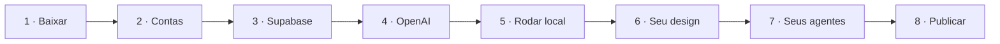

# Passo a passo

**Leigo? Use o caminho com IA:** abra o projeto no Claude Code e cole `Leia o COMECE-AQUI.md e monte o meu hub de agentes.` A IA segue estes mesmos passos com você.

| # | Guia | Tempo |
|---|---|---|
| 00 | [Visão geral](00-visao-geral.md): como funciona por dentro | 5 min |
| 01 | [Como construímos](01-como-construimos.md): o processo real, com IA | 10 min |
| 02 | [Pré-requisitos](02-pre-requisitos.md): contas, programas e custos | 20 min |
| 03 | [Supabase](03-supabase.md): banco, login e arquivos | 15 min |
| 04 | [OpenAI](04-openai.md): chave, modelos e custo | 10 min |
| 05 | [Rodar no seu computador](05-rodar-local.md) e criar o admin | 10 min |
| 06 | [Seu design system](06-design-system.md) | 20 a 60 min |
| 07 | [Inteligência e agentes](07-inteligencia-e-agentes.md) | 30 min/agente |
| 08 | [Pagamento](08-pagamento.md) (opcional) | 15 min |
| 09 | [Publicar na Vercel](09-deploy-vercel.md) | 20 min |
| 10 | [Painel admin](10-painel-admin.md) | 5 min |
| 11 | [Segurança](11-seguranca.md) | 5 min |
| 12 | [Checklist de lançamento](12-checklist-de-lancamento.md) | 10 min |
| 13 | [Problemas comuns](13-problemas-comuns.md) | quando precisar |

Apoio: [Glossário](glossario.md) · [Ajuda com IA](ajuda-com-ia.md) · [Modelo de plano](modelos/PLANO-MODELO.md)
